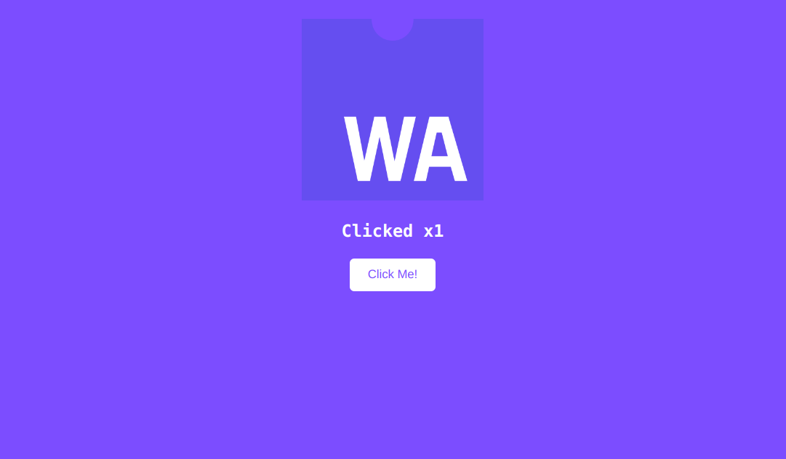

# go-wasm

#Installation
```shell
go get github.com/jnsougata/go-wasm
```

# Example

```go
package main

import (
	"fmt"

	"github.com/jnsougata/gowasm/js"
)

func main() {
	ch := make(chan struct{}, 0)
	count := 0
	document := js.New()
	document.Styles(
		js.Style{
			Object: "body",
			Values: []string{
				"background-color: #7c4dff;",
				"text-align: center;",
				"align-items: center;",
				"padding: 20px;",
				"color: #fff;",
				"font-family: Consolas,monaco,monospace;",
			},
		})
	img := document.NewImg(&js.Image{Height: 200, Width: 200, Src: "../static/wasm.png"})
	htag := document.NewHTag("Hello, WebAssembly!", 3)
	htag.SetAttribute(js.Attribute{Name: "style", Value: "color: #fff"})
	button := document.NewButton("Click Me!")
	button.SetAttribute(js.Attribute{
		Name: "style",
		Values: []string{
			"background-color: #fff;",
			"color: #7c4dff;",
			"padding: 10px 20px;",
			"border-radius: 5px;",
			"border: none;0",
		},
	})
	button.OnCLick(func(this js.Value, args []js.Value) interface{} {
		count++
		htag.SetAttribute(js.Attribute{Name: "innerHTML", Value: fmt.Sprintf("Clicked x%d", count)})
		return nil
	})
	document.Append(img.JSValue, htag.JSValue, button.JSValue)
	<-ch
}

```

# Sample Output

